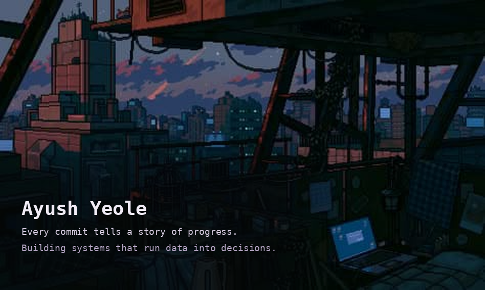
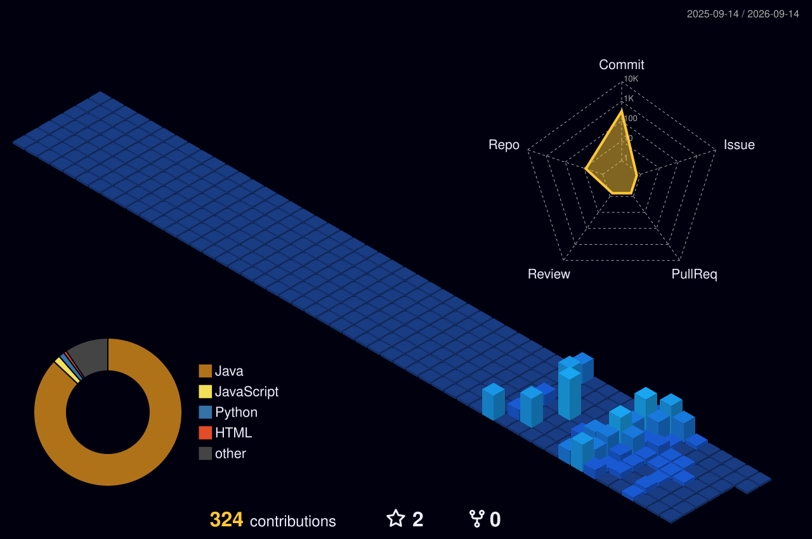

<div align="center">



<br/>

<a href="https://git.io/typing-svg">
  
</a>

<br/>


-00695C?style=for-the-badge&logo=readthedocs&logoColor=white)


<br/>

<a href="#"></a>
<a href="https://www.linkedin.com/in/ayush-yeole-653939288/"></a>
<a href="mailto:yeoleayush7@gmail.com"></a>
<a href="https://github.com/Ayushyeole18"></a>

<br/><br/>


</div>

<br/>

## About Me

<table>
<tr>
<td valign="top" width="60%">

🔭 Currently building full-stack apps and ML systems — market scanners, RL pricing agents, and more.

🌱 Learning advanced reinforcement learning, system design, and cloud fundamentals.

💬 Ask me about algorithmic trading, operating systems, or computer networks.

⚡ Interests: AI/ML, deep learning, data-driven engineering, full-stack development.

✨ Currently open to SDE internships and roles.

</td>
<td valign="top" width="40%">

</td>
</tr>
</table>

```yaml
name: "Ayush Yeole"
role: "CSE Undergraduate (AIML Minor) & Aspiring Software Engineer"
education: "BTech, Computer Science & Engineering — Yeshwantrao Chavan College of Engineering, Nagpur"
cgpa: "8.78 / 10"
focus:
  - Full-stack & backend engineering
  - Applied ML / Deep Reinforcement Learning
  - Algorithmic trading & fintech systems
mindset: "Every commit tells a story of progress."
open_to:
  - Software Engineering Internships / SDE Roles
  - AI/ML collaboration & open-source contributions
```

<br/>

## Tech Stack

**Languages**
<br/>
   

**Frontend**
<br/>
 

**Databases & Backend**
<br/>
    

**ML / Data Libraries**
<br/>
      

**Developer Tooling**
<br/>
        

<br/>

## AI / ML Expertise

<div align="center">

| Domain | Proficiency | Details |
|---|---|---|
| Reinforcement Learning | Applied (Project) | DDQN & Multi-Objective RL pricing agent with SHAP-based explainability (PriceNet) |
| Algorithmic Trading & Technical Analysis | Applied (Project) | Bollinger Band breakout detection across 180+ NSE F&O stocks with automated alerting |
| Exploratory Data Analysis | Applied (Internship) | Statistical distributions, clustering & KPI visualization using Pandas, Matplotlib |
| NLP & Sentiment Analysis | Applied (Internship & Project) | Naive Bayes/SVM sentiment pipeline (85% accuracy) and news-sentiment engine for market context |
| Anomaly Detection | Applied (Project) | Localized Z-score engine to flag irregular transactions and potential fraud |
| Time-Series Analysis | Applied (Internship) | Seasonal decomposition & trend isolation using Statsmodels for monthly cycles |
| AI/ML Foundations | Academic (Minor) | Pursuing Minor specialization in AI/ML alongside core CSE curriculum |

</div>

<br/>

## Featured Projects

<details open>
<summary><b>NSE F&O Stock Analyzer</b> — Jan 2025 – Present</summary>
<br/>

Real-time market scanner monitoring 180+ NSE F&O stocks for technical breakouts, with an integrated news-sentiment engine and Telegram alerting.

| | |
|---|---|
| **Stack** | Python · Pandas · Telebot · NLP · Multi-threading |
| **Performance** | Reduced manual screening time by ~90% via automated Bollinger Band breakout detection |
| **Automation** | Multi-threaded scheduler auto-fetches data every 2 minutes during market hours |
| **Architecture** | Modular design separating data ingestion, signal generation, and alerting layers |
| **Reliability** | Persistent logging & error-handling for uninterrupted 24/5 operation |
| **Repository** | [Algo-trading-suite](https://github.com/Ayushyeole18/Algo-trading-suite) |

</details>

<details>
<summary><b>PriceNet</b> — May 2025 – Nov 2025</summary>
<br/>

DDQN-based reinforcement learning agent that optimizes real-time e-commerce pricing using inventory, competitor, and seasonal signals.

| | |
|---|---|
| **Stack** | Python · PyTorch · Gymnasium · SHAP · Streamlit |
| **Performance** | 18% improvement in simulated profit margin |
| **Approach** | Multi-Objective RL balancing profit, inventory turnover & Customer Lifetime Value |
| **Explainability** | SHAP-based natural-language justifications for every pricing decision |
| **Safety** | Rule-based guardrail layer enforcing margin floors & price-change limits |
| **Interface** | Interactive Streamlit dashboard for live agent decisions & reward trends |

</details>

<details>
<summary><b>FinGuru</b> — Personal Finance Platform — Jan 2026 – May 2026</summary>
<br/>

AI-driven personal finance management platform simulating the RBI Account Aggregator framework to securely process and analyze large-scale transaction data.

| | |
|---|---|
| **Stack** | Python · PostgreSQL · Supabase · Streamlit · Google Gemini · GitHub Actions |
| **Scale** | Processes 5M+ transaction records |
| **Performance** | O(1) deterministic hashing to eliminate duplicate transactions during sync |
| **Security** | Symmetric encryption + 24/7 automated CI/CD security audits & email alerts |
| **Impact** | Real-time anomaly detection engine flags irregular spends & potential fraud |
| **Repository** | [FinGuru](https://github.com/Ayushyeole18/FinGuru) |

Built a real-time statistical anomaly detection engine using localized Z-scores and temporal bounding, integrated multi-modal LLM OCR to parse unstructured bank statements into a standardized schema, and deployed serverless pipelines for continuous data integrity.

</details>

<details>
<summary><b>ForexPro</b> — Currency Conversion & Analytics Platform</summary>
<br/>

Intelligent real-time currency conversion and analytics platform.

| | |
|---|---|
| **Stack** | HTML |
| **Repository** | [Forexpro](https://github.com/Ayushyeole18/Forexpro) |

</details>

<br/>

## Experience

<details open>
<summary><b>Java Development Intern</b> — Oasis Infobyte, Nagpur, Maharashtra</summary>
<br/>

**June 2025 – July 2025**

- Architected a console-based Online Examination System in Java with secure authentication, live timer, and auto-submit — reducing manual invigilation effort
- Engineered an ATM Interface using OOP principles (encapsulation, inheritance) to process secure financial transactions with full input validation
- Applied core Java and OOP concepts to design structured, maintainable console applications
- Delivered both projects within deadlines while strengthening debugging and problem-solving skills

`Java` `OOP` `CLI Development` `Debugging`

</details>

<details>
<summary><b>Data Analytics Intern</b> — Oasis Infobyte, Nagpur, Maharashtra</summary>
<br/>

**April 2025 – May 2025**

- Performed K-means clustering on 10,000+ e-commerce records, identifying 4 customer cohorts to enable targeted marketing strategies
- Delivered a sentiment analysis pipeline using NLP and ML models (Naive Bayes, SVM) achieving 85% accuracy
- Engineered a data preprocessing pipeline using Pandas and NumPy to clean, deduplicate, and validate large datasets before analysis
- Visualized statistical distributions and feature correlations using Matplotlib and Seaborn to support data-driven decisions

`Python` `Machine Learning` `NLP` `Clustering` `Pandas` `NumPy` `Matplotlib` `Seaborn`

</details>

<br/>

## Achievements

<div align="center">

| Recognition | Details |
|---|---|
| 🧩 LeetCode | Solved 150+ problems |
| 🧩 GeeksforGeeks | Solved 100+ problems |
| 🎓 Departmental Academics | Secured a position among the Top 10 students |

</div>

<br/>

## Certifications

**NPTEL**


&nbsp;`IIT Madras` · `Elite` · `87%` · Jan–Apr 2025


&nbsp;`IIT Madras` · `Elite (Top 5%)` · `81%` · Aug–Oct 2024


&nbsp;`IIT Kharagpur` · `Elite` · `68%` · Jan–Mar 2024

**Infosys Springboard**


&nbsp;Course Completion Certificate · April 2025

**Udemy**


&nbsp;`Andrii Piatakha` · `73.5 hours` · Nov 2025


&nbsp;`Vlad Budnitski` · `44 hours` · Mar 2025

<br/>

## Coding Profiles

<div align="center">

<a href="https://leetcode.com/u/Ayushyeole_18/">

</a>
<a href="https://www.geeksforgeeks.org/profile/ayushyepqwp?tab=activity">

</a>

</div>

<br/>

## GitHub Analytics

<div align="center">


</div>

<br/>

<div align="center">


</div>

<br/>

<div align="center">

<picture>
  <source media="(prefers-color-scheme: dark)" srcset="profile-3d-contrib/profile-night-view.svg" />
  <source media="(prefers-color-scheme: light)" srcset="profile-3d-contrib/profile-season.svg" />
  
</picture>

</div>

<br/>

<div align="center">


</div>

<br/>

## Current Focus

```yaml
learning:
  - Advanced ML system design & RL engineering
  - Cloud fundamentals (GCP) & DevOps practices
building:
  - "NSE F&O Stock Analyzer — real-time algo trading scanner"
  - "PriceNet — RL-based dynamic pricing engine"
exploring:
  - Full-stack backend architecture
open_to:
  - Software Engineering Internships / SDE Roles
  - AI/ML collaboration & open-source contributions
```

<br/>

## Connect With Me

<div align="center">

<a href="mailto:yeoleayush7@gmail.com"></a>
<a href="https://www.linkedin.com/in/ayush-yeole-653939288/"></a>
<a href="https://github.com/Ayushyeole18"></a>
<a href="https://leetcode.com/u/Ayushyeole_18/"></a>

</div>

<br/>

<div align="center">

*"Built with curiosity, shipped with intent."*


</div>
